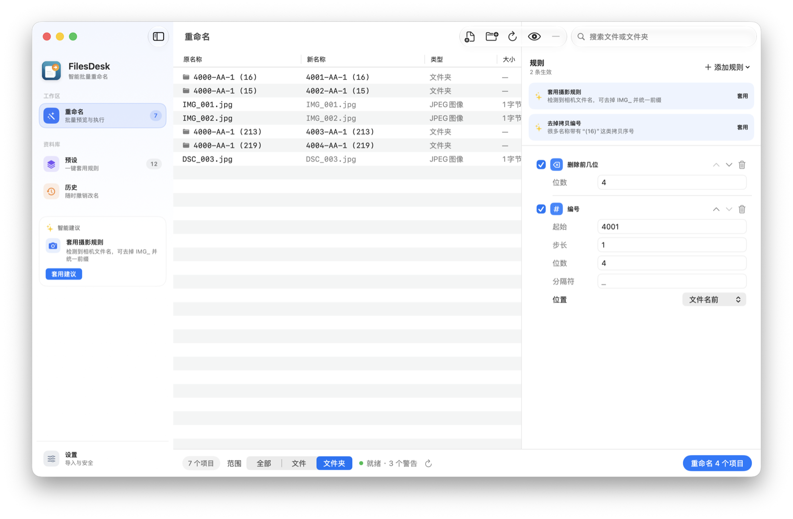
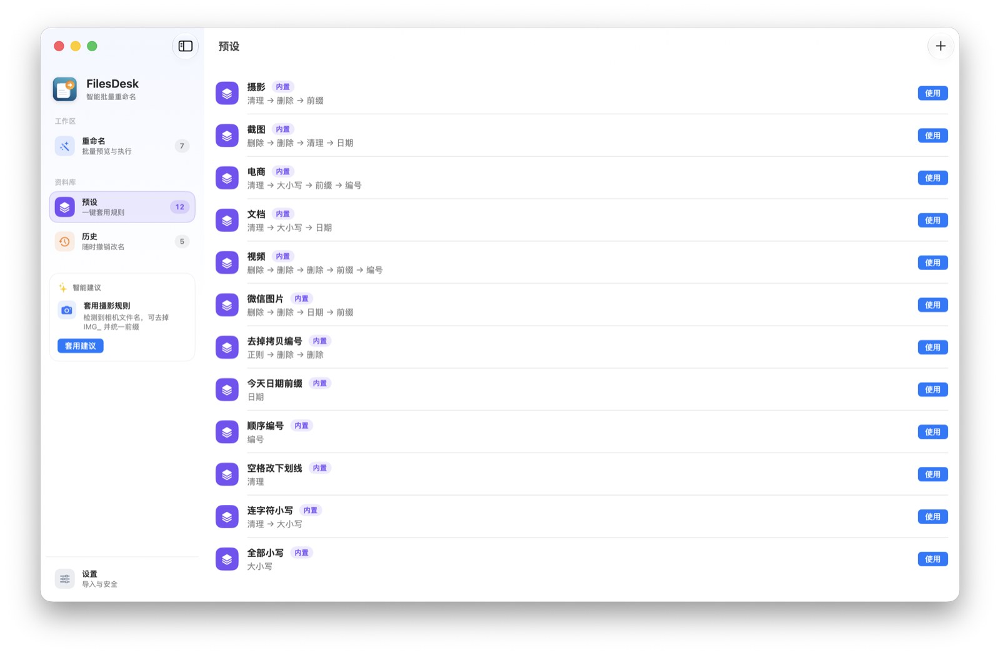

<p align="center">
  
</p>

<h1 align="center">FilesDesk</h1>

<p align="center">
  <strong>Smart batch renaming for Mac</strong><br>
  Native, safe, live preview. Rename thousands of files and folders at once.
</p>

<p align="center">
  <a href="./README.md">中文</a> · <b>English</b>
</p>

<p align="center">
  <a href="https://github.com/linux503/FilesDesk/releases/latest"></a>
  <a href="https://github.com/linux503/FilesDesk/releases"></a>
  <a href="https://github.com/linux503/FilesDesk/releases"></a>
  <a href="./LICENSE"></a>
</p>

<p align="center">
  <a href="https://linux503.github.io/FilesDesk/FilesDesk.dmg"><strong>Download DMG</strong></a>
  ·
  <a href="https://linux503.github.io/FilesDesk/">Website</a>
  ·
  <a href="https://github.com/linux503/FilesDesk/releases">All releases</a>
</p>

---

<p align="center">
  
</p>

Drop in files or folders, stack rules, and see new names immediately. Nothing is written until you click **Rename**. Conflicts block the whole batch. **Existing files are never overwritten.**

<p align="center">
  
</p>

The app UI is Chinese-first. This README is the English companion.

## Why FilesDesk

| | |
|---|---|
| **See it first** | Names update as you type. No generate button |
| **Files and folders** | One list. Scope: All / Files / Folders |
| **Undo anytime** | Every successful batch is saved in History |
| **Native Mac** | SwiftUI + AppKit, light and dark mode |
| **One installer** | Universal: Apple silicon and Intel |

## Features

| | |
|--|--|
| **Import** | Drag and drop, Add Files, Add Folder. Rename folders only, or import what is inside |
| **Live preview** | Updates as you type. Large batches run in the background |
| **Smart suggestions** | Detects camera names, screenshots, copy numbers, parent folders |
| **10 rules** | Replace, prefix, suffix, remove, drop first N, numbering, case, date, cleanup, regex |
| **Scoped numbering** | Counts only items in the current scope |
| **12 presets** | Photos, screenshots, e-commerce, documents, videos, WeChat, and more. Save your own |
| **Refresh ⌘R** | Reloads names and permissions from disk; drops missing items |
| **Validation** | Duplicates, overwrites, empty names, illegal characters, permissions — all block rename |
| **Undo / History** | Two-phase temp names (including A↔B swaps). Recovers after interruption |
| **Updates** | Sparkle in-app updates with EdDSA signatures |

## Rules

| Rule | What it does |
|------|----------------|
| Replace | Find and replace text |
| Prefix / Suffix | Insert before the name or before the extension |
| Remove | Delete matching text |
| **Drop first N** | Strip a fixed number of characters from the start (`IMG_`, `4000`, …) |
| Numbering | Sequential `001`, `4001`, … before / after / replace the name |
| Case | Lower, upper, title, sentence |
| Date | Created, modified, or now |
| Cleanup | Spaces, symbols, diacritics |
| Regex | Advanced pattern match |

Rules stack, reorder, and can be toggled on or off.

## Presets

Photography · Screenshots · E-commerce · Documents · Videos · WeChat photos · Strip copy numbers · Today’s date prefix · Sequential numbers · Spaces to underscores · Kebab-case lowercase · All lowercase

## Quick start

**Rename folders `4000-AA-1 (16)` → `4001`, `4002`, `4003`:**

1. Drop the folders in  
2. Set scope to **Folders**  
3. Add **Drop first N**, count `4`  
4. Add **Numbering**: start `4001`, 4 digits, empty separator, position **Before name**  
5. Check the preview, then **Rename**

For camera files, apply the photography suggestion or the Photography preset to strip `IMG_` and add a prefix.

## Safety

- Never overwrite a file that already exists  
- Detect duplicate names in the batch  
- Block empty and invalid filenames  
- Check directory write permission  
- Two-phase temporary rename with recovery if interrupted  

## Install

1. Download [FilesDesk.dmg](https://linux503.github.io/FilesDesk/FilesDesk.dmg)  
2. Open the disk image and drag **FilesDesk** to Applications  
3. If Gatekeeper blocks it: System Settings → Privacy & Security → Open Anyway  

Requires **macOS 14+**. The app checks for updates with Sparkle.

## Shortcuts

| Action | Key |
|--------|-----|
| Add files | ⌘O |
| Add folder | ⌘⇧O |
| Refresh | ⌘R |
| Rename | ⌘⇧R |
| Undo last rename | ⌘⌥Z |
| Quick Look | ⌘Y |
| Reveal in Finder | ⌘⌃R |
| Select all in list | ⌘⇧A |

## Build from source

Requires **Xcode 16+** and macOS 14+.

```bash
git clone https://github.com/linux503/FilesDesk.git
cd FilesDesk
make test
make build
```

Release pipeline (tests → universal binary → GitHub Release → Sparkle feed → website DMG):

```bash
make release VERSION=1.1.2
```

Keep the Sparkle private key at `sparkle/eddsa-private.key`. Never commit it.

```text
FilesDesk/           App sources
FilesDeskTests/      Rename engine tests
docs/                Website, FAQ, privacy, changelog, Sparkle feed, DMG
scripts/             Build, sign, release
```

## Links

- Website: https://linux503.github.io/FilesDesk/  
- Appcast: https://linux503.github.io/FilesDesk/appcast.xml  
- Issues: https://github.com/linux503/FilesDesk/issues  

## License

[MIT](./LICENSE)
