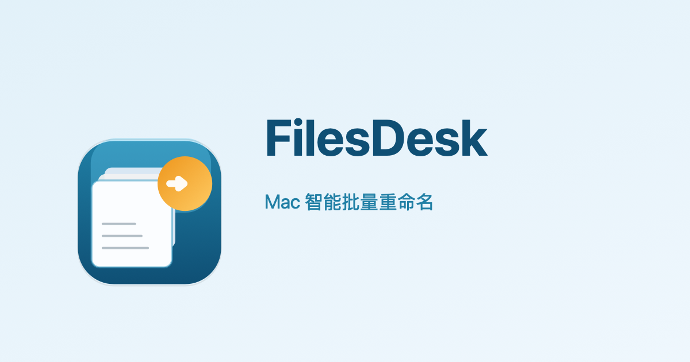

<p align="center">
  
</p>

<h1 align="center">FilesDesk</h1>

<p align="center">
  <strong>Smart batch rename for Mac</strong><br/>
  Drag and drop, combine rules, live preview. Never overwrites an existing file.
</p>

<p align="center">
  <a href="README.md">中文</a> · <b>English</b>
</p>

<p align="center">
  <a href="https://github.com/linux503/FilesDesk/releases/latest"></a>
  <a href="https://github.com/linux503/FilesDesk/releases"></a>
  <a href="LICENSE"></a>
</p>

<p align="center">
  <a href="https://linux503.github.io/FilesDesk/FilesDesk.dmg"><strong>Download DMG</strong></a>
  ·
  <a href="https://linux503.github.io/FilesDesk">Website</a>
  ·
  <a href="https://github.com/linux503/FilesDesk/releases">All releases</a>
</p>

---

<p align="center">
  
</p>

---

## Features

A native macOS batch renamer. Files and folders share one list. New names preview live. Validation runs before anything is renamed.

| Capability | Details |
|------------|---------|
| **Import** | Drag and drop, Add Files, Add Folder; nested folders can rename together |
| **Rules** | Replace, prefix, suffix, remove, drop first N characters, numbering, case, date, cleanup, regex |
| **Preview** | Updates as you type; Refresh reloads names and permissions from disk |
| **Safety** | Blocks overwrite, duplicates, empty names, and permission errors; two-phase rename |
| **Undo / history** | Undo after a run; history stays available |
| **Presets** | Built-in sets for videos, WeChat photos, copy numbers, dates, sequential names; save your own |
| **Suggestions** | Camera names, screenshots, Finder copies, folder prefixes |
| **Updates** | Sparkle + [appcast.xml](https://linux503.github.io/FilesDesk/appcast.xml) |

Requires **macOS 14+**. Universal Binary (Apple Silicon + Intel).

## Install

1. Download [FilesDesk.dmg](https://linux503.github.io/FilesDesk/FilesDesk.dmg)
2. Drag **FilesDesk** into Applications
3. The site is bilingual: https://linux503.github.io/FilesDesk

Current version **1.1.2**.

## Development

```bash
make test
make build
```

Open `FilesDesk.xcodeproj` in Xcode 16 or later.

```
FilesDesk/           App sources
FilesDeskTests/      Rename engine tests
docs/                Website, FAQ, privacy, changelog, Sparkle feed
scripts/             Build, test, tag, release
```

## Release

```bash
make test
make release VERSION=1.1.2
```

The script builds the app, runs tests, tags `vVERSION`, publishes a GitHub Release, signs the zip for Sparkle, and updates `docs/appcast.xml`.

Keep the Sparkle private key in `sparkle/eddsa-private.key` locally. Never commit it. The GitHub secret `SPARKLE_EDDSA_PRIVATE_KEY` is already configured.

## Other apps

| App | Role |
|-----|------|
| [Flare Pro](https://github.com/linux503/Flare) | Screenshot and recording |
| [ZipX](https://github.com/linux503/ZipX) | Compress / extract / preview |
| [MacText](https://github.com/linux503/MacText) | Native text editor |
| [SupTools](https://github.com/linux503/suptools) | Monitor, clean, uninstall |
| [MacFan](https://github.com/linux503/MacFan) | Fan control |

## License

[MIT](LICENSE)
